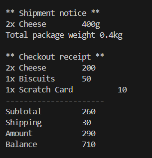

# E-Commerce System
Design an e-commerce system, i rocked it with JavaScript.

## Features
1. Products:
    - name, price, quantity
    - some products may be expired
    - some products may required shipping have weight
2. Customers:
    - add products to cart (not more than available quantity)
    - checkout:
        - output:
            - order suptotal
            - shipping fees
            - total amount
            - updated customer balance
            - shipment notice (if any)
        - error if:
            - cart is empty
            - product expired or out of stock
            - insufficient balance
3. Shipping Service
    - accept a list of shippable items

## Tech Stack
- Language: JavaScript
- No external libraries required or needed

## File Structure
- `main.js` this is the main file including working example.

## How to run
1. Make sure that you have node.js installed on your computer
    ```bash
    Node.js v20.9.0
    ```
2. Download or clone the repo
    ```bash
    git clone https://github.com/mohameddwedar689/Fawry-Rise-Journy.git
    ```
3. Go to the project dir
    ```bash
    cd fawry-rise-journy
    ```
4. Open the terminal in the project dir and run this command
    ```bash
    node main.js
    ```


## Sample Output
